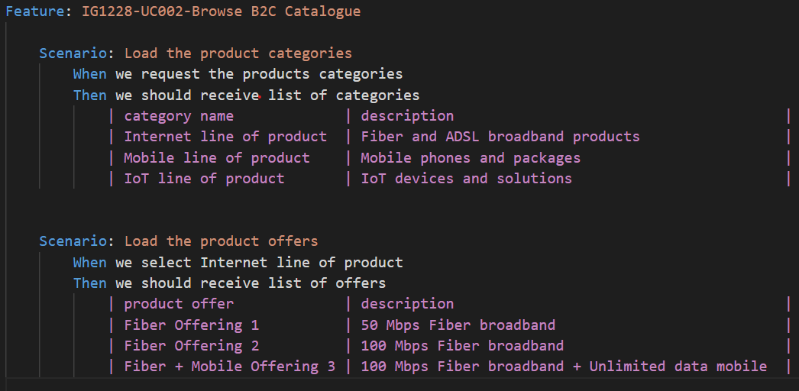

Using BDD to define Component Features using Scenarios
------------------------------------------------------

This repository is experimenting using Behavior-driven development (BDD) to document the functionality of an ODA component. 

Using the Cucumber.js (https://cucumber.io/) implementation of BDD, you describe the features of a component in a feature file using the Gherkin language (https://cucumber.io/docs/gherkin/reference/).

We are basing the example feature on the [IG1228 use-case UC002 Browse B2C Catalogue](https://projects.tmforum.org/wiki/display/PUB/Use+Case+UC002%3A+Browse+B2C+catalogue+and+check+Fiber+technical+eligibility+v1). The features file in the Gherkin language looks like:

 

This describes a business friendly structure with the feature description and some scenarios where you can test that feature in the *When* *Then* format.

A list of features described in this way would be included in the *Golden Component* definition for each functional component.

Generating automated tests from features
----------------------------------------
